```{r setup, include=FALSE}
knitr::opts_chunk$set(echo = TRUE)

#temp saved ref
#date: "Updated `r format(Sys.time(), '%B %d, %Y')`"
```

\newpage

# Introduction

Our Retrieving Environmental Analytics for Climate and Health (REACH) applications gathers environmental data via Google Earth Engine (GEE). GEE is a cloud-based platform for hosting satellite imagery (and other Earth observation data). GEE also provides tools to process these remote sensing images and other geospatial datasets. Instead of attempting to download the raw satellite files and processing them on a local computer, which requires significant internet bandwidth and processing power, these steps are done in the cloud. By using GEE, we only need to download the summarized output. 
This workflow was initially developed to support the implementation of the EPIDEMIA malaria early warning system in the Amhara region of Ethiopia. EPIDEMIA is implemented in the R language and environmental for statistical computing and provides tools for data processing and harmonization, malaria forecasting, accuracy assessment, and formatted report generation.

The updated REACH applications now generate daily summaries of satellite remote sensing data for every woreda (district) in Ethiopia. 

```{r echo = FALSE, out.width = "100%", fig.align = 'center'}
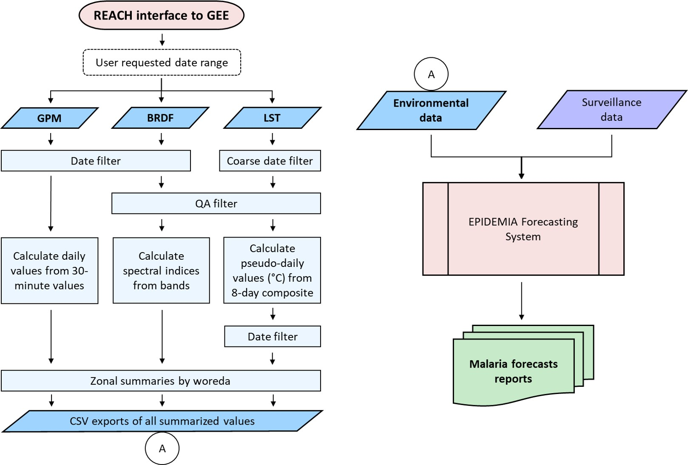
```

Flow diagram of REACH data processing for each of the three main sets of data: global precipitation measurement (GPM, using the IMERG6 product), spectral indices using the MODIS bidirectional reflectance distribution function (BRDF), and land surface temperature (LST) from the MODIS Terra 8-day product. The only required user input is the desired range of dates for which to gather the environmental data. The summarized output dataset from REACH feeds into the EPIDEMIA forecasting system as one of the main input data sources along with epidemiological surveillance data and is used to help create malaria early detection and early warning forecast reports.

# Initial Set-up

## Accounts and Software

### Google Earth Engine Account

A Google Earth Engine (GEE) account is free, you just need a Google account and request a GEE account. 

1. Request a GEE account: sign up at https://earthengine.google.com/.
If you do not already have a Google Account, it will prompt you to make one. Your Google account will also contain a Google Drive account, which is where the GEE data will be downloaded to. 

2. Wait for the account confirmation email in your gmail account. 

Optional:  You can access your drive online at https://www.google.com/drive/. Or you can download a desktop app https://www.google.com/drive/download/ and use it like a folder on your computer. 


### R and Python Software

If you are using the python package with associated R script to call it, you will also need the following software installed: 

* R: https://www.r-project.org/

* RStudio: https://rstudio.com/products/rstudio/download/

* Anaconda: https://www.anaconda.com/products/individual


## REACH tools set-up


### Github repository epidemia_reach 

The repository that contains this documentation: https://github.com/EcoGRAPH/epidemia_reach. This contains code for the GEE Code Editor, and sample scripts for the epidemia_gee python package called from R. 

#### Javascript into the GEE Code Editor

1. In the epidemia_reach repository there is a .js file (EPIDEMIA_REACH_v3.3_Ethiopia.js). This contains the latest version of the GEE Javascript script.

2. Navigate to https://code.earthengine.google.com/

3. In the "New Script" center section of the page, copy and paste the text of the script. Click on save, and name it the same as the text file (or another name of your choosing).

```{r echo = FALSE, out.width = "75%", fig.align = 'center'}
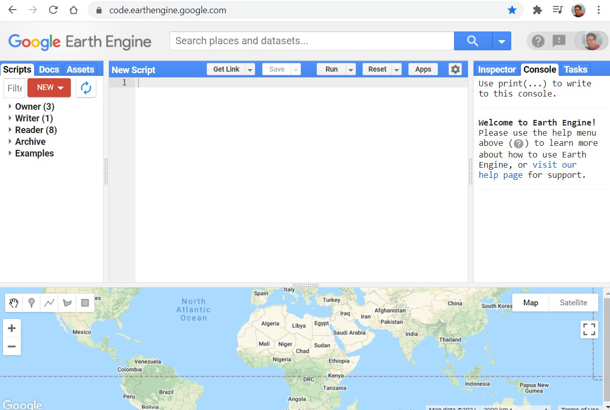
```

4. Alternatively, use the "New ... File" option in the left-hand Scripts pane to create an empty script. Click on the new script in the Scripts pane and then copy in the contents of the .js file. 

After saving, the script will be accessible under your account (most likely under owner/username/default, unless you saved it elsewhere).

```{r echo = FALSE, out.width = "75%", fig.align = 'center'}
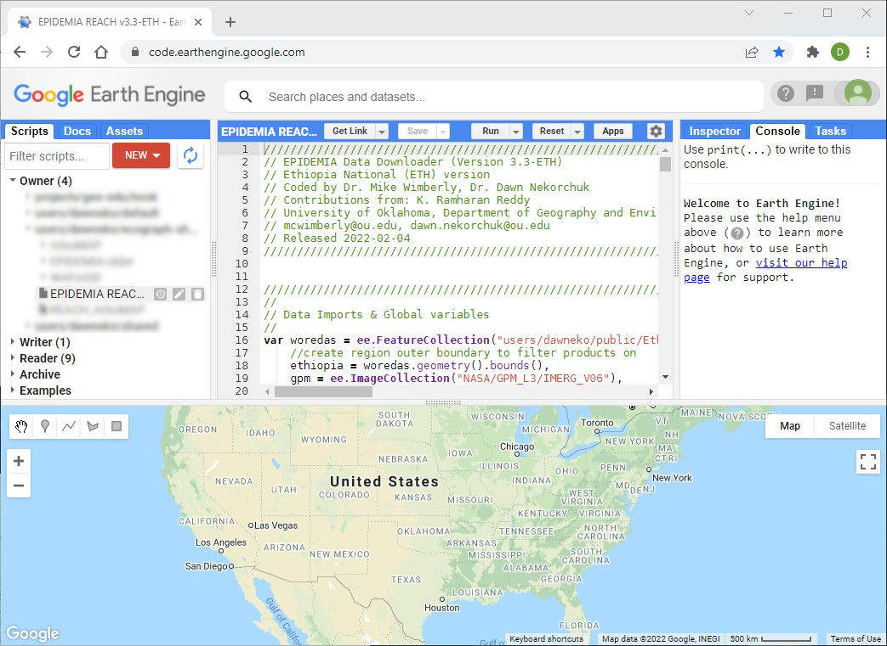
```


### Github repository epidemia_gee (python package)

#### Anaconda set-up
First, we will set up and activate a conda environment, then install the epidemia_gee and Earth Engine packages.

1. Open the “Anaconda Prompt” (Windows; and “Terminal” for MacOS) and enter in the following commands:

2. Create a conda environment:

    `conda create --name gee-demo`

3. Activate the environment:

    `conda activate gee-demo`

4. Install git pip, which we will use to install the epidemia-gee package

    `conda install git pip`
    
    And proceed (`y`) with installation of any other packages that it wishes to do.

5. Install the epidemia-gee package

    `pip install git+https://github.com/EcoGRAPH/epidemia_gee.git`

6. Install the Earth Engine package in the gee-demo environment

    `conda install -c conda-forge earthengine-api`

7. And finally, authenticate with your Earth Engine account

    `earthengine authenticate`

This will open a browser window for you to log into the Google Earth Engine Python Authenticator, click Allow, and you receive an authorization token code to paste back into the Anaconda Prompt.
After you paste in the token and it has successfully saved, you may close the Anaconda Prompt.

Note: if you need to update epidemia-gee:
From the Anaconda Terminal you will active the conda environment and then uninstall and re-install the package.

* `conda activate gee-demo`
* `pip uninstall Epidemia`
* `pip install git+https://github.com/EcoGRAPH/epidemia_gee.git`

You may also then need to re-authenticate:

* `earthengine authenticate`


# Using the REACH tools

## Code Editor

1. Navigate to https://code.earthengine.google.com/. 

2. On the left-hand scripts pane, click on the script that you saved during set-up. Once that the script is loaded in the center script pane, click on "Run". 

```{r echo = FALSE, out.width = "75%", fig.align = 'center'}
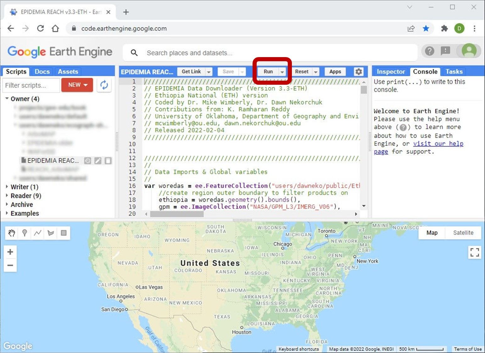
```

3. In the new "Retrieving Environmental Analytics for Climate and Health (REACH)" pane on the left-hand in the bottom section, select the desired start and end dates (circled in red in the image below). 

  + You can ignore the recommendation on shorter time lengths here. The Code Editor version does not have a time limitation, only the app version (described later). 

  + Note: Some variables may not be available up to today's date, due to time needed for compiling and processing of certain indices, so the latest available data may be a few days or weeks delayed, and this will vary by data product / set of environmental variables.
  
  + If you are using the EPIDEMIA system, those scripts will merge any overlapping data, and it is important to note that gaps in data are not allowed.

```{r echo = FALSE, out.width = "75%", fig.align = 'center'}
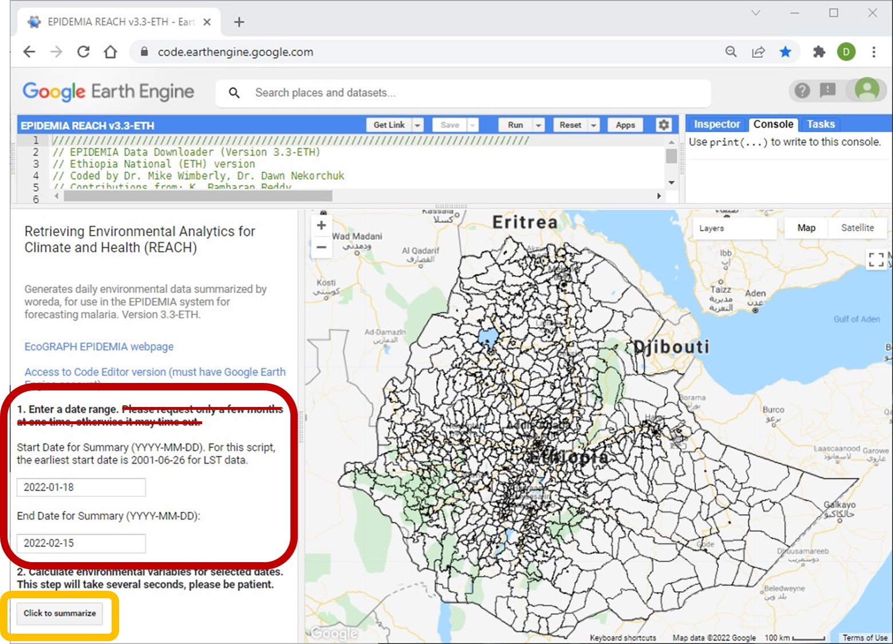
```


4. In the section '2. Calculate environmental variables for selected dates', clicking the "Click to summarize" button (circled in orange in previous image) will add tasks to the "Tasks" tab in the upper-right pane. Besides each task is a blue button "Run". Click run for each of the three tasks (Spectral, LST, Precip).  

```{r echo = FALSE, out.width = "75%", fig.align = 'center'}
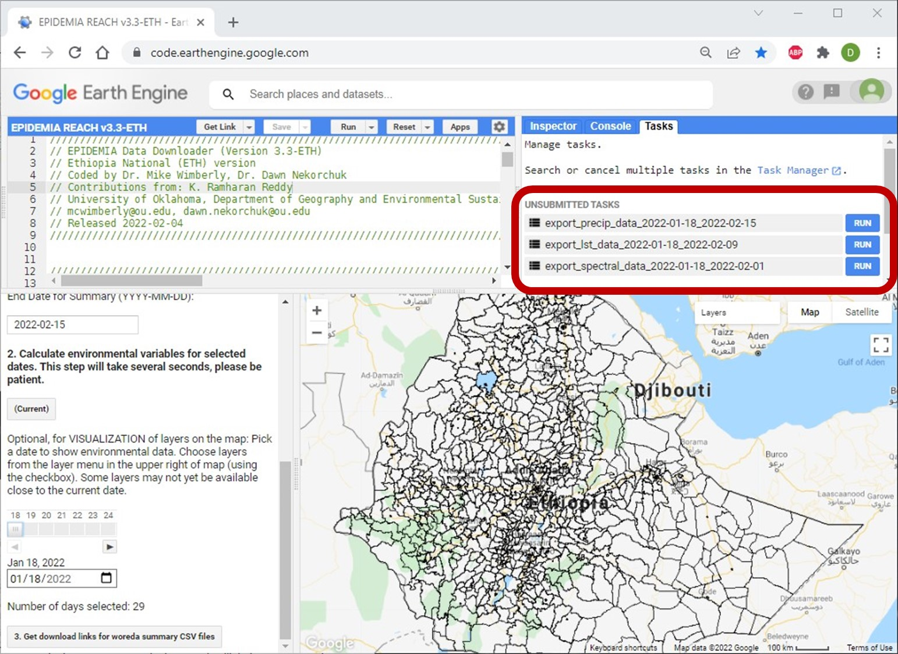
```

5. In the window that pops up, click Run. 

  + The GEE script will automatically add two dates (YYYY-MM-DD) to the end of the filename. These are the date range of data inside the file. For example, `Export_LST_Data_2022-01-18_2022-02-09` means that it contains LST data starting 18 January 2022 and ending 9 February 2022. 

  + GEE will generate the summary, and download the csv file to your Google drive.

6. Optional: The script can also be used to visualize a subset of pre-summarized environmental variables. Under section 2, there is an UI tool (circled in red in the screenshot below) to pick a date within the input range. This will display the environmental data on the map pane on the right. You can use the 'Layers' drop down menu (circled in orange) to pick which variable to display. Below, LST mean is shown for 1 February 2022. 

```{r echo = FALSE, out.width = "75%", fig.align = 'center'}
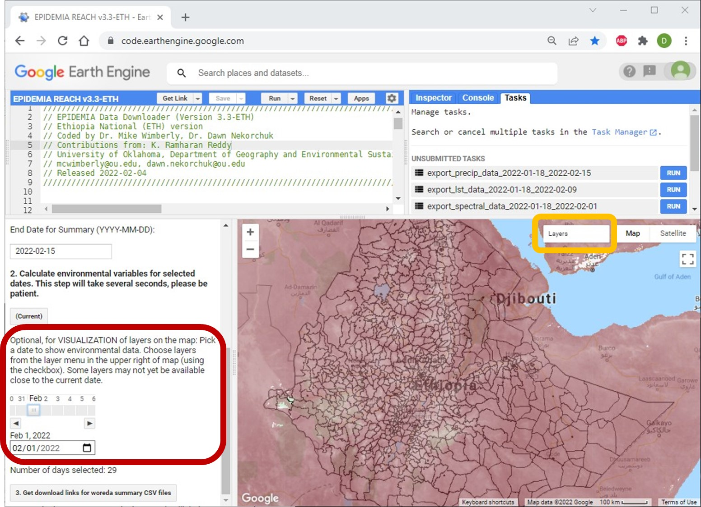
```


## REACH App

We have also created a web-based GEE app based on the above Javascript code. A Google or GEE account is NOT required, however, it is only able to downloading a few weeks to months of data at a time. 

1. Navigate to https://dawneko.users.earthengine.app/view/epidemiar-ethiopia-demo

2. In the left-hand pane "Retrieving Environmental Analytics for Climate and Health (REACH)", enter in the desired start and end dates (circled in red in the image below). The default dates are the last four weeks (to current day). 

  + Note: Some variables may not be available up to today's date, due to time needed for compiling and processing of certain indices, so the latest available data may be a few days or weeks delayed, and this will vary by data product / set of environmental variables.
  
  + If you are using the EPIDEMIA system, those scripts will merge any overlapping data, and it is important to note that gaps in data are not allowed.

```{r echo = FALSE, out.width = "75%", fig.align = 'center'}
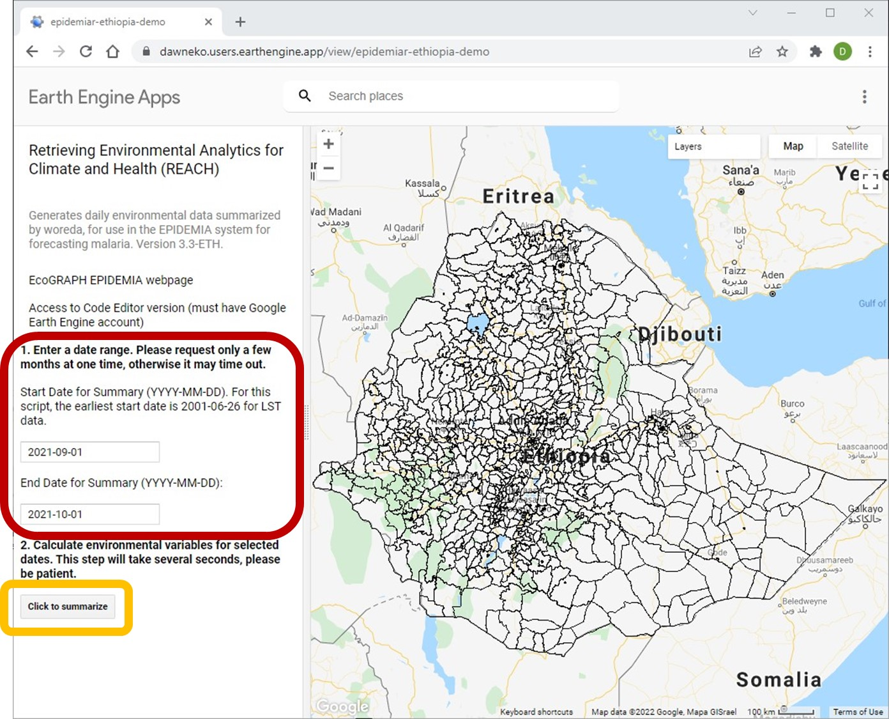
```

3. In the section '2. Calculate environmental variables for selected dates', click the "Click to summarize" button (circled in orange in previous image) and then wait for processing to happen in the background. You only need to click once, and it will take several seconds (10 - 15 seconds). 

4. New sections will appear in the bottom of the left-hand pane. Click on the button labeled '3. Get download links for woreda summary CSV files' and wait for a new section to appear. 

```{r echo = FALSE, out.width = "75%", fig.align = 'center'}
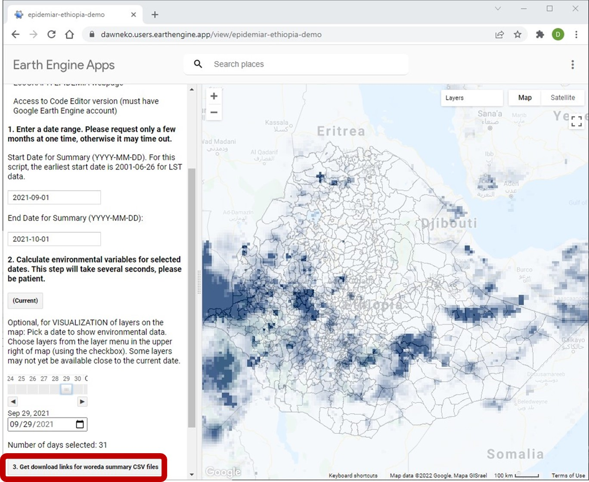
```

5. In the new download inset panel, there will be links to each of the three requested datasets ('Precipitation', 'Land Surface Temperatures', 'Spectral Indicies'). Click on the links, one at a time, to download them from your browser. 

```{r echo = FALSE, out.width = "75%", fig.align = 'center'}
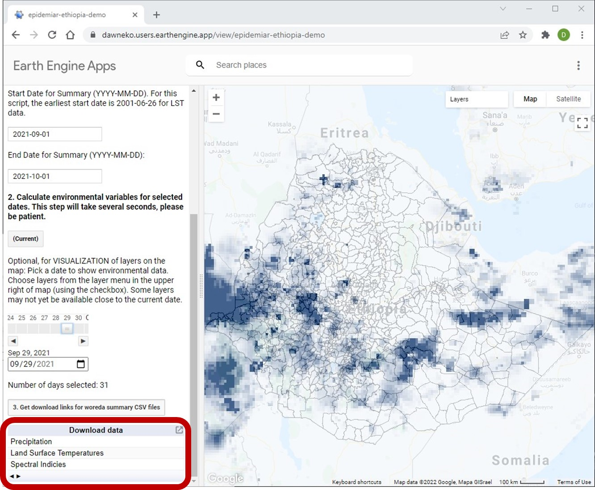
```

6. Optional: The app can also be used to visualize a subset of pre-summarized environmental variables. Under section 2, there is an UI tool (circled in red in the screenshot below) to pick a date within the input range. This will display the environmental data on the map pane on the right. You can use the 'Layers' drop down menu (circled in orange) to pick which variable to display. Below, precipitation is shown for 29 September 2021. 

```{r echo = FALSE, out.width = "75%", fig.align = 'center'}
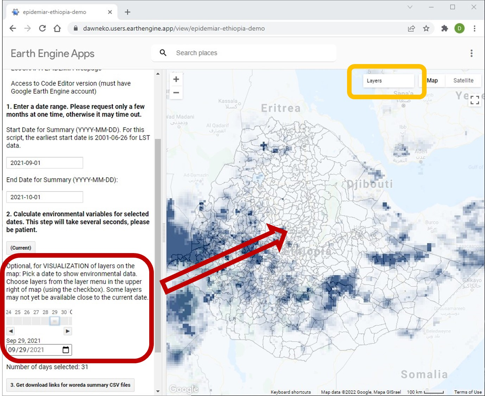
```


## R - Python

The python version is a custom python package that we call from R via the R package reticulate. 

1. Open RStudio, and then the EPIDEMIA_GEE_python.R script.

2. Run the script to the `eth_gee$Et$gee_to_drive()` calls. This section of code we just ran will let us get access to our python function `gee_to_drive()`.

3. In the `gee_to_drive()` function call, update the start and end date for the data request. The dates are in 'YYYY-MM-DD' format. 

  * e.g. `eth_gee$Et$gee_to_drive('2021-06-01','2021-06-30')` is for a start date of June 1, 2021 & end date of June 30, 2021

4. The three resulting .csv files will be downloaded to an "Ethiopiadata" folder in the Google Drive of the authenticated account.

  * The file names will lead with 'precip' for precipitation, 'lst' for land surface temperatures, and 'brdf' for the spectral indicies. The rest of the file names will be the start and end dates. 

